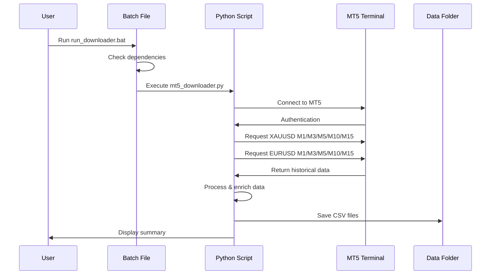
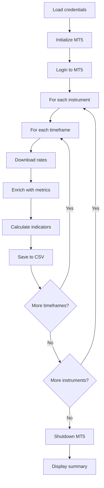

# MT5 Data Downloader

<div align="center">

### Professional MT5 Historical Data Downloader


*Download historical market data from MetaTrader 5 for XAUUSD and EURUSD with M1, M3, M5, M10, M15 timeframes*

</div>

## Visual Preview

<div align="center">

### MT5 Data Downloader in Action


*Automated data downloading with comprehensive market analysis metrics*

</div>

## Installation

<div align="center">

### Quick start (3 steps!)

</div>


**Detailed steps:**

1. **Install** Python 3.7+ and MetaTrader 5
2. **Copy** `mt5_credentials.json.example` to `mt5_credentials.json` and fill in your credentials
3. **Run** `run_downloader.bat` or execute `py mt5_downloader.py`
4. **Check** the `data/` folder for CSV files
5. **Analyze** the downloaded data in your preferred tool

> **Tip:** The script automatically installs required dependencies on first run!

## Configuration

### MT5 Connection Settings

| Parameter | Default value | Description | Tip |
|-----------|---------------|-------------|-----|
| `login` | `YOUR_LOGIN_HERE` | MT5 account login number | Required |
| `password` | `YOUR_PASSWORD_HERE` | MT5 account password | Required |
| `server` | `YOUR_SERVER_HERE` | Broker server name | e.g., "MetaQuotes-Demo" |
| `path` | `C:\Program Files\MetaTrader 5\terminal64.exe` | MT5 installation path | Auto-detected if correct |

### Instrument Configuration

| Parameter | Default value | Description | Tip |
|-----------|---------------|-------------|-----|
| `INSTRUMENTS` | `["XAUUSD", "EURUSD"]` | Symbols to download | Can be modified in script |
| `TIMEFRAMES` | `M1, M3, M5, M10, M15` | Timeframes to download | Optimized for short-term analysis |
| `TIMEFRAME_DAYS` | `M1: 30, M3: 60, M5/M10/M15: 365` | Historical data range per timeframe | Automatically configured |

### Data Download Settings

| Parameter | Default value | Description | Tip |
|-----------|---------------|-------------|-----|
| `Output Format` | `CSV` | Data export format | UTF-8 with BOM for Excel |
| `Output Directory` | `data/` | Folder for downloaded files | Auto-created if missing |
| `File Naming` | `{SYMBOL}_{TIMEFRAME}_{DATE}.csv` | File naming convention | Date format: YYYYMMDD |

### Timeframe-Specific Settings

| Timeframe | Days Back | Typical Data Volume | Best For |
|-----------|-----------|-------------------|----------|
| **M1** | 30 days | ~43,200 candles | Ultra-precise scalping |
| **M3** | 60 days | ~28,800 candles | High-frequency trading |
| **M5** | 365 days | ~105,000 candles | Short-term scalping |
| **M10** | 365 days | ~52,500 candles | Day trading |
| **M15** | 365 days | ~35,000 candles | Swing trading |

> **Recommendation:** Start with default settings for XAUUSD and EURUSD with all available timeframes!

## Usage

<div align="center">

### Data download workflow

</div>



**Step by step:**

1. **Open** `mt5_credentials.json` and fill in your MT5 credentials
2. **Double-click** `run_downloader.bat` or run from command line
3. **Wait** for the script to connect and download data
4. **Check** the console output for download status
5. **Review** CSV files in the `data/` folder
6. **Import** data into your analysis tool (Excel, Python, R, etc.)

> **Pro tip:** The script automatically handles connection errors and provides detailed status messages!

## Technical Details

### How it works



### Download Logic

| Timeframe | Method | Max Candles | Description |
|-----------|--------|-------------|-------------|
| **M1** | `copy_rates_range` + `copy_rates_from` | 100,000 | 1-minute candles (30 days) |
| **M3** | `copy_rates_range` + `copy_rates_from` | 100,000 | 3-minute candles (60 days) |
| **M5** | `copy_rates_range` + `copy_rates_from` | 100,000 | 5-minute candles (365 days) |
| **M10** | `copy_rates_range` | Unlimited | 10-minute candles (365 days) |
| **M15** | `copy_rates_range` | Unlimited | 15-minute candles (365 days) |

### Data Enrichment Process

| Metric | Calculation | Purpose |
|--------|-------------|---------|
| **Range** | `high - low` | Candle volatility |
| **Body** | `abs(close - open)` | Candle body size |
| **Upper Wick** | `high - max(open, close)` | Upper shadow length |
| **Lower Wick** | `min(open, close) - low` | Lower shadow length |
| **Is Bullish** | `close > open ? 1 : 0` | Candle direction |
| **Spread** | From symbol info | Broker spread |
| **Point** | From symbol info | Price precision |
| **Digits** | From symbol info | Decimal places |

### CSV File Structure

| Column | Type | Description | Example |
|--------|------|-------------|---------|
| `time` | DateTime | Candle timestamp | 2025-01-05 20:00:00 |
| `symbol` | String | Instrument name | XAUUSD |
| `timeframe` | String | Timeframe | M5 |
| `open` | Float | Opening price | 2650.50 |
| `high` | Float | Highest price | 2651.20 |
| `low` | Float | Lowest price | 2650.30 |
| `close` | Float | Closing price | 2650.80 |
| `tick_volume` | Integer | Tick volume | 1250 |
| `spread` | Float | Spread in points | 0.3 |
| `range` | Float | Price range | 0.90 |
| `body` | Float | Body size | 0.30 |
| `upper_wick` | Float | Upper wick | 0.40 |
| `lower_wick` | Float | Lower wick | 0.20 |
| `is_bullish` | Integer | Bullish flag | 1 |
| `point` | Float | Point value | 0.01 |
| `digits` | Integer | Decimal places | 2 |

## Instrument-Specific Characteristics

### XAUUSD (Gold) Market Dynamics

| Characteristic | Value | Impact on Data |
|----------------|-------|----------------|
| **Trading Hours** | 24/5 | Continuous data flow |
| **Volatility** | High | Large price ranges |
| **Spread** | 0.2-0.5 points | Consider in analysis |
| **Price Precision** | 2 decimals | Standard format |
| **Point Value** | 0.01 | Minimum price movement |

### EURUSD Market Dynamics

| Characteristic | Value | Impact on Data |
|----------------|-------|----------------|
| **Trading Hours** | 24/5 | Continuous data flow |
| **Volatility** | Medium-High | Moderate price ranges |
| **Spread** | 0.1-0.3 points | Tight spreads |
| **Price Precision** | 5 decimals | High precision |
| **Point Value** | 0.00001 | Pip value |

## Timeframe Analysis

### M1 (1-Minute) Timeframe

| Purpose | Best For | Data Volume |
|---------|----------|-------------|
| **Ultra Scalping** | Very short-term entries | ~43,200 candles/30 days |
| **Maximum Precision** | Exact entry/exit timing | Highest granularity |
| **Tick Analysis** | Micro-movements analysis | Minute-by-minute data |
| **High-Frequency** | HFT strategies | Real-time precision |

### M3 (3-Minute) Timeframe

| Purpose | Best For | Data Volume |
|---------|----------|-------------|
| **High-Frequency Trading** | Rapid entries/exits | ~28,800 candles/60 days |
| **Precision Trading** | Short-term positions | High granularity |
| **Session Scalping** | Intraday scalping | Session-specific patterns |
| **Quick Decisions** | Fast market reactions | Reduced noise vs M1 |

### M5 (5-Minute) Timeframe

| Purpose | Best For | Data Volume |
|---------|----------|-------------|
| **Scalping** | Short-term entries | ~100,000 candles/year |
| **Precision** | Exact entry/exit timing | High granularity |
| **Session Analysis** | Intraday patterns | Session-specific data |

### M10 (10-Minute) Timeframe

| Purpose | Best For | Data Volume |
|---------|----------|-------------|
| **Day Trading** | Medium-term positions | ~50,000 candles/year |
| **Balance** | Noise reduction | Good signal quality |
| **Trend Following** | Clear trend identification | Reduced noise |

### M15 (15-Minute) Timeframe

| Purpose | Best For | Data Volume |
|---------|----------|-------------|
| **Swing Trading** | Multi-day positions | ~35,000 candles/year |
| **Structure** | Market structure analysis | Clear patterns |
| **Confirmation** | Signal confirmation | Lower noise |

## Error Handling

### Common Issues and Solutions

| Error | Cause | Solution |
|-------|-------|----------|
| **Connection Failed** | MT5 not running | Start MT5 terminal |
| **Invalid Credentials** | Wrong login/password | Check `mt5_credentials.json` |
| **Symbol Not Found** | Symbol not available | Verify symbol name in MT5 |
| **No Data Returned** | Insufficient history | Check broker data availability |
| **Encoding Error** | Windows console issue | Already handled in script |

### Status Messages

| Message | Meaning | Action |
|---------|---------|--------|
| `[OK] Uspesne pripojeno k MT5` | Connected successfully | Continue |
| `[OK] Stazeno X svicek` | Data downloaded | Check CSV file |
| `[VAROVANI] Nepodarilo se stahnout` | Download failed | Check error details |
| `[CHYBA]` | Critical error | Review configuration |

## Data Analysis Examples

### Python Analysis

```python
import pandas as pd

# Load data
df = pd.read_csv('data/XAUUSD_M5_20260105.csv')

# Basic statistics
print(df.describe())

# Calculate average range
avg_range = df['range'].mean()
print(f"Average candle range: {avg_range}")

# Bullish vs Bearish ratio
bullish_ratio = df['is_bullish'].mean()
print(f"Bullish candles: {bullish_ratio:.2%}")
```

### Excel Analysis

1. **Open** CSV file in Excel
2. **Create** pivot tables for timeframe comparison
3. **Build** charts for price action visualization
4. **Calculate** custom indicators using formulas
5. **Filter** by date ranges for specific analysis

## Performance Metrics

### Download Performance

| Metric | Target Value | Typical Performance |
|--------|--------------|---------------------|
| **Connection Time** | <5 seconds | 2-3 seconds |
| **Download Speed** | >1000 candles/sec | 2000-5000 candles/sec |
| **Total Time (10 files)** | <3 minutes | 60-90 seconds |
| **File Size (M1)** | ~3-5 MB | 30 days of data |
| **File Size (M3)** | ~2-4 MB | 60 days of data |
| **File Size (M5)** | ~5-10 MB | Depends on data range |
| **File Size (M15)** | ~2-5 MB | Depends on data range |

### Data Quality

| Quality Metric | Standard | Verification |
|----------------|----------|--------------|
| **Completeness** | 100% | No missing candles |
| **Accuracy** | 100% | Matches MT5 terminal |
| **Consistency** | 100% | Uniform format |
| **Encoding** | UTF-8 | Excel compatible |

## Warnings

<div align="center">

### Important information before use!

</div>

| Warning | Description | Reason |
|---------|-------------|--------|
| **MT5 Required** | MetaTrader 5 must be installed | Script uses MT5 API |
| **Active Connection** | MT5 account must be active | Data access requires login |
| **Data Availability** | Historical data depends on broker | Some brokers limit history |
| **Time Zone** | Data uses UTC timezone | Adjust for local time |
| **File Overwrite** | Files are overwritten daily | Backup important data |

> **Golden rule:** "Always verify downloaded data matches MT5 terminal before analysis!"

## Changelog

### Version 1.0 - "MT5 Data Downloader"

| Feature | Status | Description |
|---------|--------|-------------|
| Multi-Instrument Support | ✅ | XAUUSD and EURUSD |
| Multi-Timeframe Support | ✅ | M1, M3, M5, M10, M15 timeframes |
| Data Enrichment | ✅ | Range, body, wicks, spread |
| Automatic CSV Export | ✅ | UTF-8 with BOM encoding |
| Error Handling | ✅ | Comprehensive error messages |
| Batch File Support | ✅ | Easy Windows execution |
| Credentials Management | ✅ | Secure JSON configuration |
| Progress Reporting | ✅ | Real-time download status |

> **Version 1.0 features:** Complete MT5 data downloader with automatic data enrichment, multi-timeframe support, and comprehensive error handling!

## License

<div align="center">

### 📄 MIT License

**Free to use for commercial and non-commercial purposes!**

[](https://opensource.org/licenses/MIT)

</div>

This project is licensed under the MIT License - see the [LICENSE](LICENSE) file for details.

## Author

<div align="center">

### 👨‍💻 MT5 Data Downloader Developer

**Created with 💼 professional trading data expertise**

[](https://www.python.org/)
[](https://www.metatrader5.com/)

</div>

| Contact | Link |
|---------|------|
| **Support** | I welcome feedback and suggestions! |
| **Issues** | Report bugs via GitHub Issues |

## Support

<div align="center">

### Need help with data downloading?

</div>


**How to get help:**

1. **Read** this README for detailed instructions
2. **Check** console error messages for specific issues
3. **Verify** MT5 credentials and connection
4. **Test** with demo account first
5. **Review** CSV files for data quality

---

<div align="center">

### If you like this data downloader...

**Don't forget to give it a star!** ⭐

*Every star motivates further development!*

</div>

## Additional Resources

### Recommended Analysis Tools

| Tool | Purpose | Compatibility |
|------|---------|---------------|
| **Python (pandas)** | Data analysis and processing | Direct CSV import |
| **Excel** | Spreadsheet analysis | UTF-8 BOM support |
| **R** | Statistical analysis | CSV import |
| **TradingView** | Charting and indicators | Manual CSV upload |
| **MetaTrader 5** | Backtesting and analysis | Native MT5 format |

### Data Usage Examples

- **Backtesting**: Import into MT5 Strategy Tester
- **Machine Learning**: Use as training data for ML models
- **Statistical Analysis**: Calculate correlations and patterns
- **Chart Analysis**: Visualize in TradingView or MT5
- **Report Generation**: Create trading reports and summaries

---

<div align="center">

**Happy Trading! 📈📊**

*Professional market data at your fingertips*

</div>
